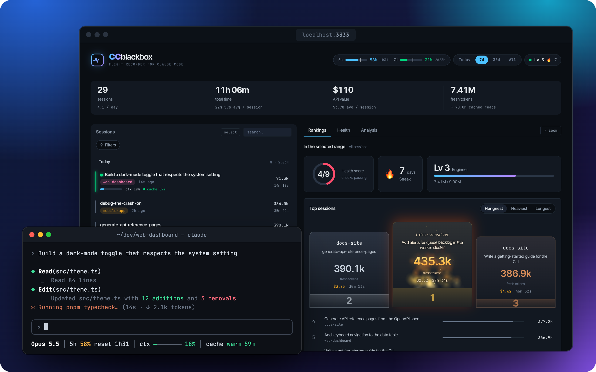
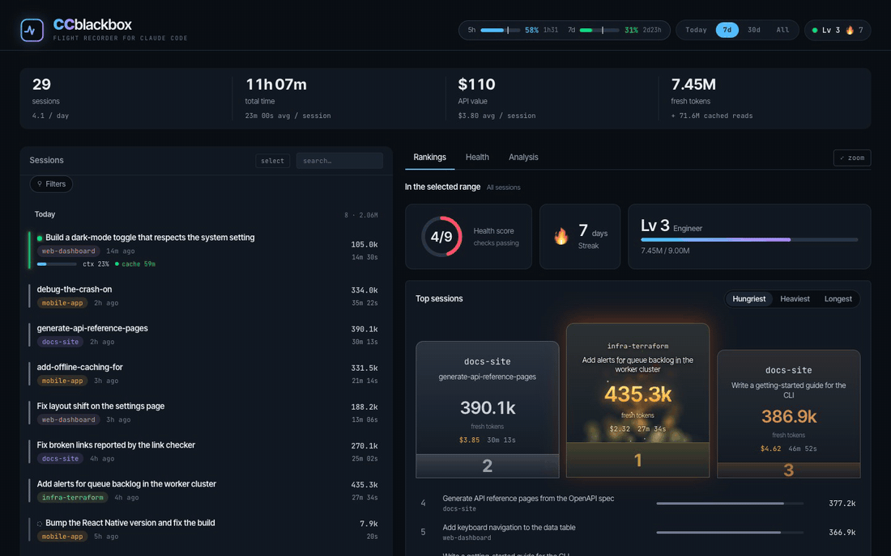
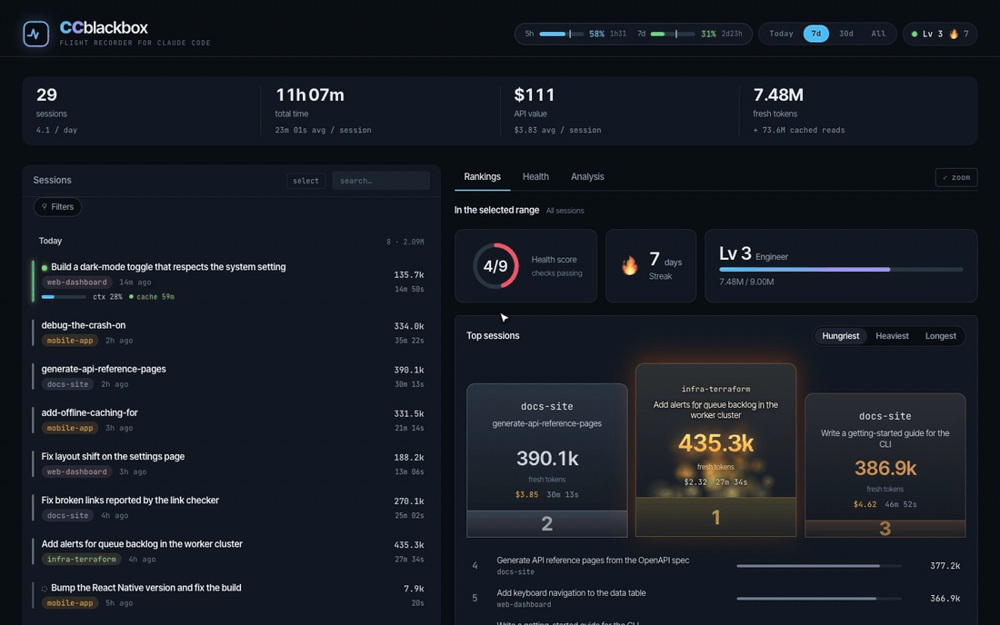
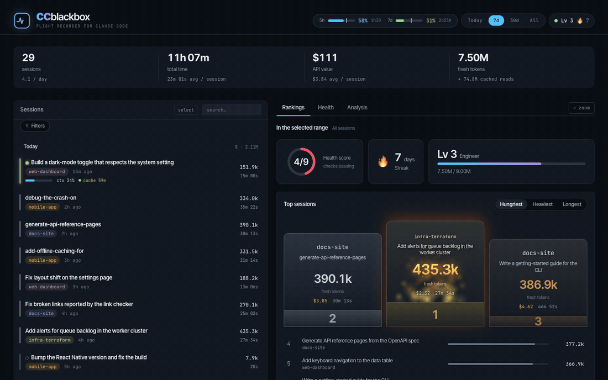
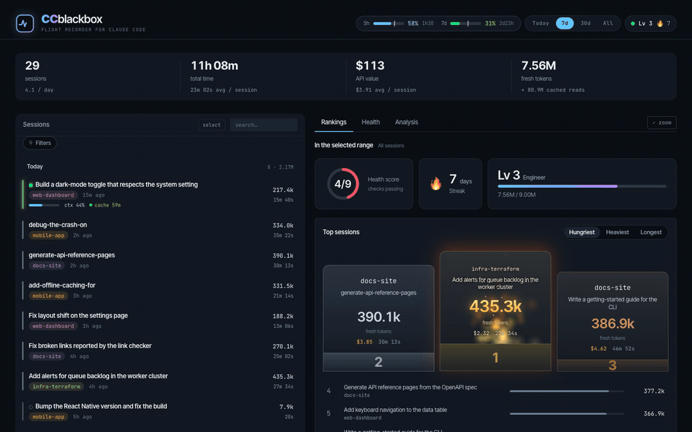

<h1 align="center">
   CCblackbox
</h1>

<p align="center">
  <a href="https://github.com/n-pizzetta/ccblackbox/releases"></a>
  
  
  
</p>

<p align="center">
  <strong>The flight recorder for your Claude Code sessions.</strong><br/>
  Replay every turn, see where the tokens went, and spot the sessions that went sideways — all from data already on your disk.
</p>

<h3 align="center"><a href="#install"><ins>Install as a Claude Code plugin</ins></a></h3>

<p align="center">
  
</p>

`ccblackbox` reads the session data Claude Code already writes under `~/.claude/` and turns it into a local dashboard. The data is already there. Nothing visualizes it. This does.

## Features

<table>
<tr>
<td width="40%" valign="middle">

### Session Replay

Turn-by-turn view of prompts, tool calls and file diffs (versioned via `~/.claude/file-history/`), with quality signals and a friction breakdown. Export any session as a self-contained HTML snapshot.

</td>
<td width="60%">
  
</td>
</tr>
<tr>
<td width="40%" valign="middle">

### Timeline

Context fill, cumulative API value and tokens per turn, with compactions, prompts and failed tool calls marked. Hover any turn for its numbers, or click a prompt marker to see the tool calls it triggered.

</td>
<td width="60%">
  
</td>
</tr>
<tr>
<td width="40%" valign="middle">

### Live View

Running sessions show up in real time with the current tool, context fill and prompt-cache countdown, plus a *keep going / compact / clear* verdict and its reasons.

</td>
<td width="60%">
  
</td>
</tr>
<tr>
<td width="40%" valign="middle">

### Fleet Dashboard

Rankings, health checks and analysis across all your projects: top sessions, model mix, tools heatmap, anomaly flags and the current 5-hour window against your real 5h / 7-day limits.

</td>
<td width="60%">
  
</td>
</tr>
<tr>
<td width="40%" valign="middle">

### Filter &amp; Compare

Filter by live / ghost / friction / low-outcome / low-quality or by project, navigate with `j`/`k`, and put up to three sessions side by side with min/max highlighting.

</td>
<td width="60%">
  
</td>
</tr>
<tr>
<td width="40%" valign="middle">

### Ghost Cleanup

Empty sessions and sessions whose Claude Code process died are flagged. Get the resume command, reveal the transcript, or delete it permanently.

</td>
<td width="60%">
  
</td>
</tr>
</table>

<p align="center"><sub>All screenshots use synthetic data from <code>pnpm seed:demo</code>.</sub></p>

---

## Install

### As a Claude Code plugin (recommended)

**1. Add the plugin.** In Claude Code:

```
/plugin marketplace add n-pizzetta/ccblackbox
/plugin install ccblackbox@ccblackbox
```

**2. Open the dashboard.** `/ccblackbox:replay` parses `~/.claude` and opens `localhost:3333`.

**3. Connect your limits** *(recommended)*. `/ccblackbox:limits` turns on the real 5h and 7-day limits and the context advice. Re-run it after updating ccblackbox; `/ccblackbox:limits --uninstall` undoes it.

Needs Node 20+ on your `PATH`.

<details>
<summary>What <code>/ccblackbox:limits</code> changes</summary>

Claude Code only exposes your 5-hour and 7-day usage limits (the numbers behind `/usage`) to the status line, so the command installs a small wrapper that records them for the dashboard:

- Your existing status line keeps rendering unchanged, and `settings.json` is backed up first.
- It also records each live session's context fill and prompt-cache warmth, which power the *keep going / compact / clear* verdict in the session view.
- A short `ctx ━━━───── 33% │ cache warm 59m` segment is appended to your status line, colored green / yellow / red by level. Hide it with `"verdict": false` in `~/.claude/ccblackbox/statusline.json`.
- `statusLine.refreshInterval` is set to 30 seconds (unless you already set one) so the cache countdown keeps moving while the session is idle.

Without it, the dashboard still shows tokens and cost for an inferred 5h window, just not the limit percentages.

</details>

The plugin also registers a `PostToolUse` hook that records fine-grained tool sequences to `~/.claude/ccblackbox/cache/{sessionId}.jsonl`, so sessions can be replayed call by call.

### From source

Requires Node 20+ and pnpm.

```sh
git clone https://github.com/n-pizzetta/ccblackbox && cd ccblackbox
pnpm install
pnpm serve                            # parse ~/.claude/, serve on :3333 and open the browser
node scripts/serve.mjs --help         # --port, --no-open
node scripts/install-statusline.mjs   # optional: real usage limits (see above)
```

---

## Privacy

**Everything runs locally: no network calls, no telemetry.** `ccblackbox` reads (from `~/.claude`, or `$CLAUDE_CONFIG_DIR` when set):

| Data | Source |
| --- | --- |
| Prompts and assistant outputs | `~/.claude/projects/*/*.jsonl`, `~/.claude/history.jsonl` |
| Session metadata, tool counts, tokens, cost | `~/.claude/usage-data/` |
| Versioned snapshots of files edited via Claude Code | `~/.claude/file-history/` |
| Live session state | `~/.claude/sessions/` |

The server only listens on `127.0.0.1` and refuses state-changing requests from other websites. The optional `pnpm parse` dump is written to `~/.claude/ccblackbox/sessions.json`, never inside the repo.

## Pricing

Costs are estimates at Anthropic's public API rates (no batch or negotiated discounts; on a Pro/Max plan they are an API-equivalent value, not what you pay). The table lives in [`scripts/models.mjs`](./scripts/models.mjs) and every turn is priced with its own model.

A model missing from the table still gets a readable name and is priced like the latest model of its family. Costs that include it are marked `~` in the dashboard. To fix one without waiting for a release, add it to `~/.claude/ccblackbox/models.json` (prices in USD per million tokens; picked up on the next refresh):

```json
{
  "claude-opus-6": { "label": "Opus 6", "in": 6, "out": 30, "cacheRead": 0.6 }
}
```

Cache writes are derived from `in` (1.25x for the 5-minute TTL, 2x for 1 hour). Entries override built-in rows with the same id.

---

## Developing

```sh
pnpm dev          # Vite dev server with live re-parse on ~/.claude changes
pnpm lint         # ESLint
pnpm typecheck    # tsc
pnpm build        # typecheck + build → dist/ (committed: the plugin ships it prebuilt)
pnpm test         # node --test (parser)
pnpm parse        # one-shot dump of every session to ~/.claude/ccblackbox/sessions.json
```

The dev server and `scripts/serve.mjs` mount the same API (`scripts/api.mjs`): it runs the parser in-process, keeps sessions in memory and re-parses when `~/.claude/` changes (unchanged transcripts are cached). The front-end fetches a lightweight list (`/api/sessions`) and loads each session's detail on demand (`/api/sessions/:id`). If the API is unreachable, it falls back to built-in demo data.

```
~/.claude/{projects, sessions, usage-data, file-history, history.jsonl}
                  │
                  ▼
     scripts/parse-sessions.mjs      transcripts → sessions (+ scripts/models.mjs pricing)
                  │
                  ▼
     scripts/api.mjs                 in-memory cache, re-parse on change, /api/*
     (mounted by scripts/serve.mjs and by vite.config.ts in dev)
                  │
                  ▼ fetch
   React 19 SPA (hash routing)
   ├─ StatsStrip / SessionList / SessionFilters
   ├─ SessionDetail (Overview / Timeline / Tools / Tokens / Files)
   ├─ SessionCompare
   └─ FleetDashboard (src/components/fleet/)
```

See [`ARCHITECTURE.md`](./ARCHITECTURE.md) for the parser internals, component map and build pipeline.

**Stack:** React 19, TypeScript, Vite, `diff`, bundled Inter Tight / JetBrains Mono fonts. The server uses Node built-ins only.

### Known limitations

- Cold start re-parses every session (a few seconds with several hundred sessions).
- Live-session detection uses `ps`, so on Windows running sessions show as crashed. Windows is otherwise untested.
- Test coverage is thin: only the parser has tests (`pnpm test`).

---

## Community &amp; Support

- **Feedback &amp; ideas:** missing something? [Open an issue](https://github.com/n-pizzetta/ccblackbox/issues).
- **Contributing:** pull requests are welcome. See [`CONTRIBUTING.md`](./CONTRIBUTING.md) for setup, the synthetic demo data (`pnpm seed:demo`) and the privacy rules.
- **Security:** see [`SECURITY.md`](./SECURITY.md) to report a vulnerability.
- **Release notes &amp; roadmap:** [`CHANGELOG.md`](./CHANGELOG.md).
- **Show support:** [star the repo](https://github.com/n-pizzetta/ccblackbox) to follow along.

## License

ccblackbox is free and open source under the [MIT License](./LICENSE).
