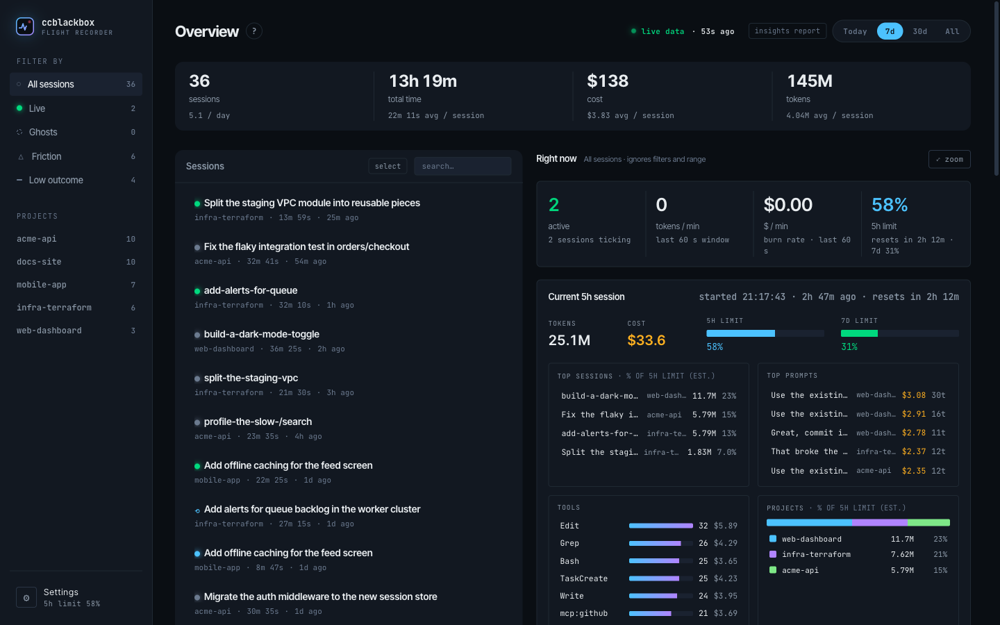

<p align="center"></p>

# ccblackbox

> The flight recorder for your Claude Code sessions.

`ccblackbox` reads the session data Claude Code already writes under `~/.claude/` and turns it into a local dashboard: turn-by-turn replays, tool breakdowns, file diffs, friction maps, token/cost analytics and fleet-wide views across all your projects.

The data is already on your disk. Nothing visualizes it. This does.



## Features

- **Session list**: filterable (live / ghost / friction / failed / low-quality), keyboard-navigable (`j`/`k`).
- **Session replay**: turn-by-turn view of prompts, tool calls and file diffs (versioned via `~/.claude/file-history/`), plus quality signals and a friction breakdown. Every session can be exported as a self-contained HTML snapshot.
- **Session compare**: side-by-side metrics for several sessions, with min/max highlighting.
- **Fleet dashboard**: token time series, model mix, top sessions, project rollup, tools heatmap, anomaly flags, and a 5-hour window view with your real 5h / 7-day usage limits, spike alerts and drill-down.
- **Live view**: active sessions show up in real time, with the running tool, current burn rate and a sparkline of recent turns.
- **Ghost cleanup**: empty sessions and sessions whose Claude Code process died can be inspected, revealed in Finder, or permanently deleted.

## Privacy

Everything runs locally: no network calls, no telemetry. `ccblackbox` reads (from `~/.claude`, or `$CLAUDE_CONFIG_DIR` when set):

- Prompts and assistant outputs (`~/.claude/projects/*/*.jsonl`, `~/.claude/history.jsonl`)
- Session metadata, tool counts, tokens, cost (`~/.claude/usage-data/`)
- Versioned snapshots of files edited via Claude Code (`~/.claude/file-history/`)
- Live session state (`~/.claude/sessions/`)

The server only listens on `127.0.0.1` and refuses state-changing requests from other websites. The optional `pnpm parse` dump is written to `~/.claude/ccblackbox/sessions.json`, never inside the repo.

## Install

### As a Claude Code plugin (recommended)

Add the marketplace and enable the plugin in `~/.claude/settings.json`:

```jsonc
{
  "extraKnownMarketplaces": {
    "ccblackbox": {
      "source": { "source": "github", "repo": "n-pizzetta/ccblackbox" }
    }
  },
  "enabledPlugins": {
    "ccblackbox@ccblackbox": true
  }
}
```

Then run `/ccblackbox:replay` (or `/replay`) to open the dashboard. The plugin also registers a `PostToolUse` hook that records fine-grained tool sequences to `~/.claude/ccblackbox/cache/{sessionId}.jsonl`, so sessions can be replayed call by call.

#### Real usage limits (optional)

Claude Code only exposes your 5-hour and 7-day usage limits (the numbers behind `/usage`) to the status line. Run `/ccblackbox:limits` once to install a small wrapper that records them for the dashboard. Your existing status line keeps rendering unchanged, and `settings.json` is backed up first. Undo with `/ccblackbox:limits --uninstall`.

Without it, the dashboard still shows tokens and cost for an inferred 5h window, just not the limit percentages.

### From source

Requires Node 20+ and pnpm.

```sh
git clone https://github.com/n-pizzetta/ccblackbox && cd ccblackbox
pnpm install
pnpm serve                       # parse ~/.claude/, serve on :3333 and open the browser
node scripts/serve.mjs --help    # --port, --no-open
node scripts/install-statusline.mjs   # optional: real usage limits (see above)
```

## Pricing

Costs are estimates at Anthropic's public API rates (no batch or negotiated discounts; on a Pro/Max plan they are an API-equivalent value, not what you pay). The table lives in [`scripts/models.mjs`](./scripts/models.mjs) and every turn is priced with its own model.

A model missing from the table still gets a readable name and is priced like the latest model of its family. Costs that include it are marked `~` in the dashboard. To fix one without waiting for a release, add it to `~/.claude/ccblackbox/models.json` (prices in USD per million tokens; picked up on the next refresh):

```json
{
  "claude-opus-6": { "label": "Opus 6", "in": 6, "out": 30, "cacheRead": 0.6 }
}
```

Cache writes are derived from `in` (1.25x for the 5-minute TTL, 2x for 1 hour). Entries override built-in rows with the same id.

## Development

```sh
pnpm dev          # Vite dev server with live re-parse on ~/.claude changes
pnpm lint         # ESLint
pnpm typecheck    # tsc
pnpm build        # typecheck + build → dist/ (committed: the plugin ships it prebuilt)
pnpm parse        # one-shot dump of every session to ~/.claude/ccblackbox/sessions.json
```

The dev server and `scripts/serve.mjs` mount the same API (`scripts/api.mjs`): it runs the parser in-process, keeps sessions in memory and re-parses when `~/.claude/` changes (unchanged transcripts are cached). The front-end fetches a lightweight list (`/api/sessions`) and loads each session's detail on demand (`/api/sessions/:id`). If the API is unreachable, it falls back to built-in demo data.

```
~/.claude/{projects, sessions, usage-data, file-history, history.jsonl}
                  │
                  ▼
     scripts/parse-sessions.mjs      transcripts → sessions (+ scripts/models.mjs pricing)
                  │
                  ▼
     scripts/api.mjs                 in-memory cache, re-parse on change, /api/*
     (mounted by scripts/serve.mjs and by vite.config.ts in dev)
                  │
                  ▼ fetch
   React 19 SPA (hash routing)
   ├─ StatsStrip / SessionList / SessionFilters
   ├─ SessionDetail (Overview / Tools / Tokens / Files)
   ├─ SessionCompare
   └─ FleetDashboard (src/components/fleet/)
```

See [`ARCHITECTURE.md`](./ARCHITECTURE.md) for the parser internals, component map and build pipeline.

**Stack:** React 19, TypeScript, Vite, `diff`, bundled Inter Tight / JetBrains Mono fonts. The server uses Node built-ins only.

## Known limitations

- Cold start re-parses every session (a few seconds with several hundred sessions).
- Live-session detection uses `ps`, so on Windows running sessions show as crashed. Windows is otherwise untested.
- No automated tests yet.

See [`CHANGELOG.md`](./CHANGELOG.md) for release notes and the roadmap.

## Contributing

Issues and pull requests are welcome. See [`CONTRIBUTING.md`](./CONTRIBUTING.md) for setup, the synthetic demo data (`pnpm seed:demo`) and the privacy rules.

## License

[MIT](./LICENSE)
